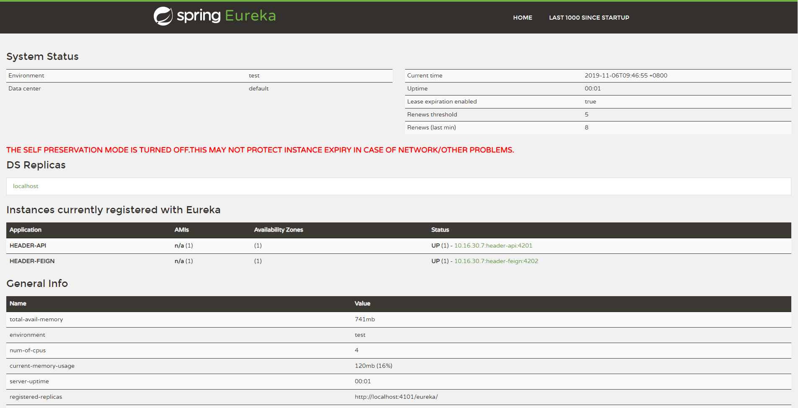
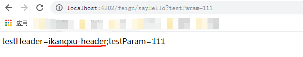

### 准备工作

模拟头信息添加

```java
    @Override
    public void doFilter(ServletRequest servletRequest, ServletResponse servletResponse, FilterChain filterChain) throws IOException, ServletException {
        HttpServletRequest request = (HttpServletRequest) servletRequest;
        HttpServletResponse response = (HttpServletResponse) servletResponse;

        MutableHttpServletRequestWrapper wrapper = new MutableHttpServletRequestWrapper(request);
        wrapper.putHeader("testHeader", "ikangxu-header");

        filterChain.doFilter(wrapper, response);
    }
```

### 测试结果

首先运行 `eureka` 项目，保证注册中心正常运行。    
打开浏览器，访问`http://localhost:4101/`网址，出现以下页面，为正常启动



然后启动 `api`，默认端口`4201`

代码输出如下

```java
    @GetMapping("sayHello")
    public String sayHello(
            @RequestHeader(value = "testHeader", required = false) String testHeader,
            @RequestParam("testParam") String testParam
    ) {
        return new StringBuilder("testHeader=").append(testHeader)
                .append(";testParam=").append(testParam)
                .toString();
    }
```


最后启动 `feign`，默认端口`4202`

打开浏览器，访问 `http://localhost:4202/feign/sayHello?testParam=111`，得到以下结果



